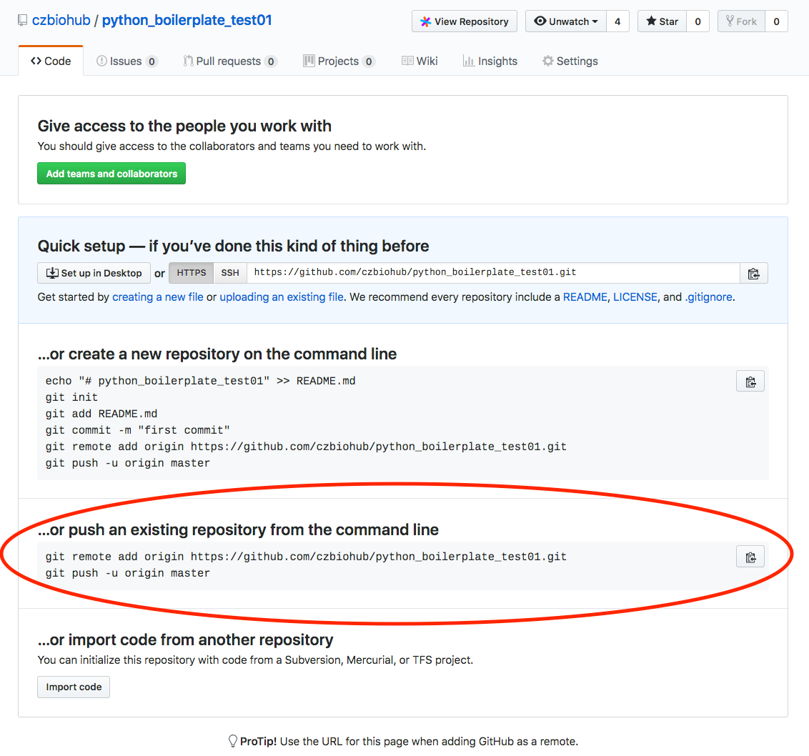

cookiecutter-pypackage
======================

Cookiecutter template for a Python package. See <https://github.com/audreyr/cookiecutter>.


The above code was used to generate
[this example Python package](https://github.com/czbiohub/examplepy).

-   Free software: MIT License
- Python package setup with setup.py
-   [pytest](https://docs.pytest.org/en/latest/ ) testing setup
-   [Travis-CI](http://travis-ci.org/): Ready for Travis Continuous Integration testing
    - Tests Python 3.6 and 3.7
    - Installs [miniconda](https://docs.conda.io/en/latest/miniconda.html) on
      Travis
-   [Sphinx](http://sphinx-doc.org/) docs: Documentation ready for generation with, for example, [ReadTheDocs](https://readthedocs.org/)
- Python [Click](https://click.palletsprojects.com/en/7.x/) library for simple
  command line interfaces with support for "git-like" subcommands
- [Colorama](https://pypi.org/project/colorama/) for colorful command line
  outputs
- [tqdm](https://tqdm.github.io/) for progress bars
- Specifies "Chan Zuckerberg Biohub" as the organization in the copyright
  sections of th
- e License and documentation
- Adds MacOS, Python, and JetBrains files to gitignore


Usage
-----


- [0. Install cookiecutter](#0-install-cookiecutter)
- [1. Generate a Python package project:](#1-generate-a-python-package-project)
- [2. Change to the newly created directory and initialize git](#2-change-to-the-newly-created-directory-and-initialize-git)
- [3. Create the remote repository on GitHub](#3-create-the-remote-repository-on-github)
- [4. Push the newly created Python package to GitHub](#4-push-the-newly-created-python-package-to-github)
- [5. Install your package!](#5-install-your-package)
- [6. Check out the `hello` subcommand of your program!](#6-check-out-the-hello-subcommand-of-your-program)
- [7. Check out the tests!](#7-check-out-the-tests)
- [8. Add autogenerated documentation](#8-add-autogenerated-documentation)
- [9. Release your package!](#9-release-your-package)


### 0. Install cookiecutter

[Cookiecutter](https://cookiecutter.readthedocs.io/en/latest/) is an awesome
package for generating package templates.

```
conda create -n cookiecutter --yes cookiecutter
conda activate cookiecutter
```


### 1. Generate a Python package project:

    cookiecutter https://github.com/czbiohub/cookiecutter-pypackage.git

This will give you a "quiz" to ask you your name, the name of the project,
release date and so on. Pressing "Enter" will use the default values.


Example output:

```
(base)
 ✘  Wed 27 Mar - 17:13  ~/code 
  cookiecutter https://github.com/czbiohub/cookiecutter-pypackage.git
You've downloaded /Users/olgabot/.cookiecutters/cookiecutter-pypackage before. Is it okay to delete and re-download it? [yes]: y
full_name [Rosalind Franklin]: Olga Botvinnik
email [olga.botvinnik@czbiohub.org]:
organization [Chan Zuckerberg Biohub]:
github_username [czbiohub]:
project_name [Python Boilerplate]: Python Boilerplate Test01
repo_name [examplepy]:
project_short_description [Python Boilerplate contains all the boilerplate you need to create a Python package.]:
release_date [2019-03-27]:
year [2019]:
license [MIT]:
version [0.1.0]:
```

### 2. Change to the newly created directory and initialize git

E.g. if your project is named `examplepy`

```
cd examplepy
```
Initialize git and add files:

```
git init
git add -A .
git commit -m "First commit"
```

Example output:

```
(base)
 Wed 27 Mar - 17:18  ~/code 
  cd examplepy
(base)
 Wed 27 Mar - 17:19  ~/code/examplepy 
  git init
Initialized empty Git repository in /Users/olgabot/code/examplepy/.git/
(base)
 Wed 27 Mar - 17:31  ~/code/examplepy   master ✔ 16☀ 
  git add -A .
(base)
 Wed 27 Mar - 17:31  ~/code/examplepy   master 40✚ ⚑ 
  git commit -m "First commit"
[master (root-commit) d1b241d] First commit
 40 files changed, 1923 insertions(+)
 create mode 100644 .editorconfig
 create mode 100644 .gitignore
 create mode 100644 .travis.yml
 create mode 100644 AUTHORS.md
 create mode 100644 CONTRIBUTING.md
 create mode 100644 HISTORY.md
 create mode 100644 LICENSE
 create mode 100644 MANIFEST.in
 create mode 100644 Makefile
 create mode 100644 README.md
 create mode 100644 conda_requirements.txt
 create mode 100644 docs/CHANGELOG_sphinx_deployment.md
 create mode 100644 docs/LICENSE_sphinx_deployment
 create mode 100644 docs/Makefile
 create mode 100644 docs/README_sphinx_deployment.md
 create mode 100644 docs/authors.rst
 create mode 100755 docs/conf.py
 create mode 100644 docs/contributing.rst
 create mode 100644 docs/history.rst
 create mode 100644 docs/index.rst
 create mode 100644 docs/installation.rst
 create mode 100644 docs/make.bat
 create mode 100644 docs/readme.rst
 create mode 100644 docs/releases/v0.1.0.rst
 create mode 100644 docs/rsync_exclude
 create mode 100644 docs/sphinx_deployment.mk
 create mode 100644 docs/tutorial.rst
 create mode 100644 docs/usage.rst
 create mode 100755 examplepy/__init__.py
 create mode 100644 examplepy/commandline.py
 create mode 100644 examplepy/hello.py
 create mode 100644 examplepy/os_utils.py
 create mode 100755 examplepy/examplepy.py
 create mode 100755 examplepy/tests/__init__.py
 create mode 100644 examplepy/tests/conftest.py
 create mode 100644 examplepy/tests/test_os_utils.py
 create mode 100755 examplepy/tests/test_examplepy.py
 create mode 100644 requirements.txt
 create mode 100644 setup.cfg
 create mode 100755 setup.py
```

### 3. Create the remote repository on GitHub

Go to [github.com]([https://github.com](https://github.com/) ) and click the
plus sign ("+") to create a repository under the `czbiohub` organization. Since
via `cookiecutter` we already have a README and LICENSE, we don't need those
files. We'll want to check the box for Travis-CI integration to run the tests
for the code automatically.


### 4. Push the newly created Python package to GitHub

After the repository is created, now we need to push the files we created
locally to the remote repository.



```
git remote add origin https://github.com/czbiohub/examplepy.git
git push -u origin master
```


### 5. Install your package!

First, you'll want to create an environment, then activate it, and install the package.

```
conda create -n examplepy python=3.6 --file conda_requirements.txt
conda activate examplepy
pip install -e .
```

Here's the example output for the installation:

```
(base)
 Mon  1 Apr - 17:33  ~/code/examplepy 
  conda create -n examplepy python=3.6 --file conda_requirements.txt
Collecting package metadata: done
Solving environment: done

## Package Plan ##

  environment location: /anaconda3/envs/examplepy

  added / updated specs:
    - click
    - colorama
    - coverage
    - flake8
    - pytest
    - python=3.6
    - tqdm


The following NEW packages will be INSTALLED:

  atomicwrites       conda-forge/noarch::atomicwrites-1.3.0-py_0
  attrs              conda-forge/noarch::attrs-19.1.0-py_0
  ca-certificates    conda-forge/osx-64::ca-certificates-2019.3.9-hecc5488_0
  certifi            conda-forge/osx-64::certifi-2019.3.9-py36_0
  click              conda-forge/noarch::click-7.0-py_0
  colorama           conda-forge/noarch::colorama-0.4.1-py_0
  coverage           conda-forge/osx-64::coverage-4.5.3-py36h1de35cc_0
  entrypoints        conda-forge/osx-64::entrypoints-0.3-py36_1000
  flake8             conda-forge/osx-64::flake8-3.7.7-py36_0
  libcxx             pkgs/main/osx-64::libcxx-4.0.1-hcfea43d_1
  libcxxabi          pkgs/main/osx-64::libcxxabi-4.0.1-hcfea43d_1
  libffi             conda-forge/osx-64::libffi-3.2.1-h6de7cb9_1006
  mccabe             conda-forge/noarch::mccabe-0.6.1-py_1
  more-itertools     conda-forge/osx-64::more-itertools-4.3.0-py36_1000
  ncurses            conda-forge/osx-64::ncurses-6.1-h0a44026_1002
  openssl            conda-forge/osx-64::openssl-1.1.1b-h01d97ff_2
  pip                conda-forge/osx-64::pip-19.0.3-py36_0
  pluggy             conda-forge/noarch::pluggy-0.9.0-py_0
  py                 conda-forge/noarch::py-1.8.0-py_0
  pycodestyle        conda-forge/noarch::pycodestyle-2.5.0-py_0
  pyflakes           conda-forge/noarch::pyflakes-2.1.1-py_0
  pytest             conda-forge/osx-64::pytest-4.4.0-py36_1
  python             conda-forge/osx-64::python-3.6.7-h8dc6b48_1004
  readline           conda-forge/osx-64::readline-7.0-hcfe32e1_1001
  setuptools         conda-forge/osx-64::setuptools-40.8.0-py36_0
  six                conda-forge/osx-64::six-1.12.0-py36_1000
  sqlite             conda-forge/osx-64::sqlite-3.26.0-h1765d9f_1001
  tk                 conda-forge/osx-64::tk-8.6.9-ha441bb4_1001
  tqdm               conda-forge/noarch::tqdm-4.31.1-py_0
  wheel              conda-forge/osx-64::wheel-0.33.1-py36_0
  xz                 conda-forge/osx-64::xz-5.2.4-h1de35cc_1001
  zlib               conda-forge/osx-64::zlib-1.2.11-h1de35cc_1004


Preparing transaction: done
Verifying transaction: done
Executing transaction: done
#
# To activate this environment, use
#
#     $ conda activate examplepy
#
# To deactivate an active environment, use
#
#     $ conda deactivate

(base)
 Mon  1 Apr - 17:34  ~/code/examplepy 
  conda activate examplepy
(examplepy)
 Mon  1 Apr - 17:34  ~/code/examplepy 
  pip install -e .
Obtaining file:///Users/olgabot/code/examplepy
Requirement already satisfied: pytest in /anaconda3/envs/examplepy/lib/python3.6/site-packages (from examplepy==0.1.0) (4.4.0)
Requirement already satisfied: flake8 in /anaconda3/envs/examplepy/lib/python3.6/site-packages (from examplepy==0.1.0) (3.7.7)
Requirement already satisfied: coverage in /anaconda3/envs/examplepy/lib/python3.6/site-packages (from examplepy==0.1.0) (4.5.3)
Requirement already satisfied: click in /anaconda3/envs/examplepy/lib/python3.6/site-packages (from examplepy==0.1.0) (7.0)
Requirement already satisfied: setuptools>=38.6.0 in /anaconda3/envs/examplepy/lib/python3.6/site-packages (from examplepy==0.1.0) (40.8.0)
Requirement already satisfied: tqdm in /anaconda3/envs/examplepy/lib/python3.6/site-packages (from examplepy==0.1.0) (4.31.1)
Requirement already satisfied: colorama in /anaconda3/envs/examplepy/lib/python3.6/site-packages (from examplepy==0.1.0) (0.4.1)
Requirement already satisfied: py>=1.5.0 in /anaconda3/envs/examplepy/lib/python3.6/site-packages (from pytest->examplepy==0.1.0) (1.8.0)
Requirement already satisfied: six>=1.10.0 in /anaconda3/envs/examplepy/lib/python3.6/site-packages (from pytest->examplepy==0.1.0) (1.12.0)
Requirement already satisfied: attrs>=17.4.0 in /anaconda3/envs/examplepy/lib/python3.6/site-packages (from pytest->examplepy==0.1.0) (19.1.0)
Requirement already satisfied: atomicwrites>=1.0 in /anaconda3/envs/examplepy/lib/python3.6/site-packages (from pytest->examplepy==0.1.0) (1.3.0)
Requirement already satisfied: pluggy>=0.9 in /anaconda3/envs/examplepy/lib/python3.6/site-packages (from pytest->examplepy==0.1.0) (0.9.0)
Requirement already satisfied: more-itertools>=4.0.0 in /anaconda3/envs/examplepy/lib/python3.6/site-packages (from pytest->examplepy==0.1.0) (4.3.0)
Requirement already satisfied: entrypoints<0.4.0,>=0.3.0 in /anaconda3/envs/examplepy/lib/python3.6/site-packages (from flake8->examplepy==0.1.0) (0.3)
Requirement already satisfied: pyflakes<2.2.0,>=2.1.0 in /anaconda3/envs/examplepy/lib/python3.6/site-packages (from flake8->examplepy==0.1.0) (2.1.1)
Requirement already satisfied: pycodestyle<2.6.0,>=2.5.0 in /anaconda3/envs/examplepy/lib/python3.6/site-packages (from flake8->examplepy==0.1.0) (2.5.0)
Requirement already satisfied: mccabe<0.7.0,>=0.6.0 in /anaconda3/envs/examplepy/lib/python3.6/site-packages (from flake8->examplepy==0.1.0) (0.6.1)
Installing collected packages: examplepy
  Running setup.py develop for examplepy
Successfully installed examplepy
```


### 6. Check out the `hello` subcommand of your program!

This comes pre-canned with an example command line subcommand and how to test it.


```
(examplepy)
 Mon  1 Apr - 17:34  ~/code/examplepy 
  examplepy hello --name olga
  0%|                                                                                                                 | 0/5 [00:00<?, ?it/s]Hello olga!
Hello olga!
Hello olga!
Hello olga!
Hello olga!
100%|██████████████████████████████████████████████████████████████████████████████████████████████████████| 5/5 [00:00<00:00, 20400.31it/s]

```

The percent and blocks are using [`tqdm`](https://github.com/tqdm/tqdm) which
is a nice progress bar in Python.

### 7. Check out the tests!

Try running the tests with the `make test` command. See the full command in the
[`Makefile`]({{cookiecutter.repo_name}}/Makefile).

```
(examplepy)
 ✘  Mon  1 Apr - 17:43  ~/code/examplepy   origin ☊ master 1● 
  make test
py.test
=========================================================== test session starts ============================================================
platform darwin -- Python 3.6.7, pytest-4.4.0, py-1.8.0, pluggy-0.9.0
rootdir: /Users/olgabot/code/examplepy
collected 10 items

examplepy/tests/test_commandline.py ...                                                                                              [ 30%]
examplepy/tests/test_hello.py ...                                                                                                    [ 60%]
examplepy/tests/test_os_utils.py ....                                                                                                [100%]

======================================================== 10 passed in 0.13 seconds =========================================================
```


### 8. Add autogenerated documentation

[Read The Docs](https://readthedocs.org/) is a great way to host and generate
your documentation. The


### 9. Release your package!

Once you're ready to push your code to PyPI, release your package the standard
Python way. Here's a release checklist:
<https://gist.github.com/olgabot/5990987>
